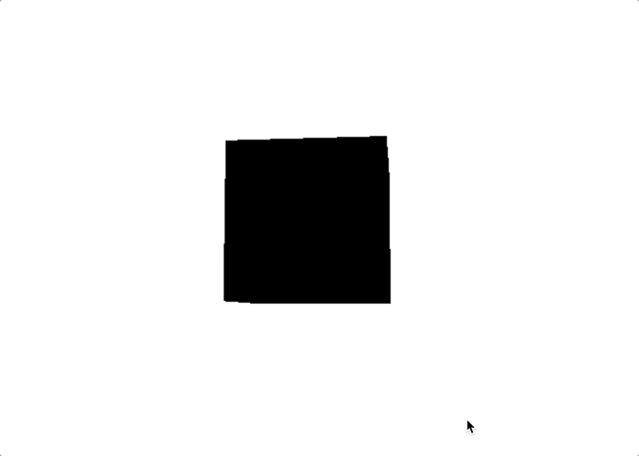
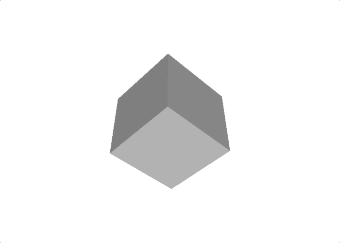

# threejs-color

Exploring color in Three.js. Code starting point is the [Creating a scene](https://threejs.org/docs/index.html#manual/en/introduction/Creating-a-scene) introduction on the three.js documentation site.

## Color Basics
Branch: https://github.com/mrjasonweaver/threejs-color/tree/color-basics

Adds basic color creation and manipulation examples

### Color Initialization
- Initialize a color with `Color( r : Color_Hex_or_String, g : Float, b : Float )`
- Hexadecimal is recommended: `const white = new THREE.Color( 0xffffff );`
- RGB string: `const white = new THREE.Color('rgb(255,255,255)');`
- Separate RGB values between 0 and 1: `const white = new THREE.Color(1, 1, 1);`

### Changing scene background color
- Alpha transparency support: `const renderer = new THREE.WebGLRenderer({ alpha: true });`
- `scene.background = white;`

### Changing cube color on user input 
- Setting color: `cube.material.color.set(cubeColor);`
- Setting `cubeColor` on keyboard user input

## Color Tweening
Branch: https://github.com/mrjasonweaver/threejs-color/tree/color-tweening

Adds color tweening example

### Setting up state
- Defining the cube state object
- Defining `tweenColors()` function 

### Conditional to start tween
- Using `requestAnimationFrame`
- `Color.equals()` to test if 2 colors are the same

## MeshStandardMaterial and Lighting
Branch: https://github.com/mrjasonweaver/threejs-color/tree/color-mesh-standard-material-lighting

Adds MeshStandardMaterial and directionalLighting

### MeshStandardMaterial
- Defining `MeshStandardMaterial` to use for the cube
- Change the default cube color from black to grey

### Lighting
- Adding `directionalLight` to the scene
- Adjust lighting position

